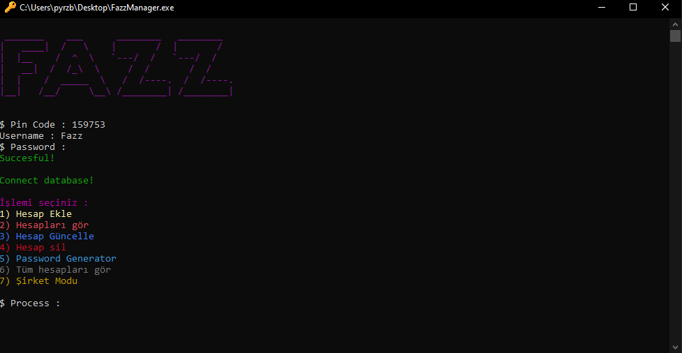

# Fazz | Python password wanager with MongoDB
## Using :

*1.* **Bir mongodb hesabı açın.** 
*2.* **Veritabanı oluşturun ve ana menüdeki "Connect" butonundan pythonu seçip linki alın** 
*3.* **Kodun içindeki client komutunun içine yapıştırın. (Username ve Password kısmını yaptığım gibi ilk önce input alarak girebilirsiniz.)** 
*4.* **Programı başlatıp istediğiniz hesabı kendi veritabanınızda tutabilirsiniz tebrikler!** 

> MongoDB Veritabanı kullanımı, güvenliği ve şifreleme gibi konuları barındırdığım yada ekliyecek olduğum repo'ya göz atabilirsiniz. 

*Repo : * [https://github.com/FazzPy/FazzPython](FazzPython) 

 

*Not : Şirket Modu şirket bilgileriniz için ayrı bir koleksiyon açar ve oraya gizli şirket verilerinizi kaydedebilirsiniz.* 

**Geliştirilmeye devam edecektir...**
